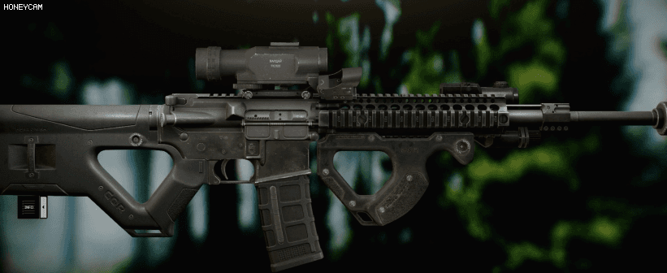

# weapon workbench
    This project is clone coding of weapon mod editor from Escape from Tarkov.
## project goals

# Issue
- No issue for now

# TODO
- 3d model import
    - Parsing obj file [Done]
    - Generate VBO for opengl rendering [Done]
    - texture mapping [Partially]
        - diffuse map [Done]
        - normal map
        - shader code generation?
- Design part file
    - anchor point
    - 3d models to use
    - etc.
- View manipulation
    - Implementing Camera class [Done]
    - FSM for camera mode
- Editor feature

# Limitation of this editor
- Obj file
    - All of faces must be triangulated.
    - Face elements of obj file must have vertex, texture and normal indices.
        - none of these can be omitted.
- Texture
    - Texture should be PNG of 24bit(RGB).